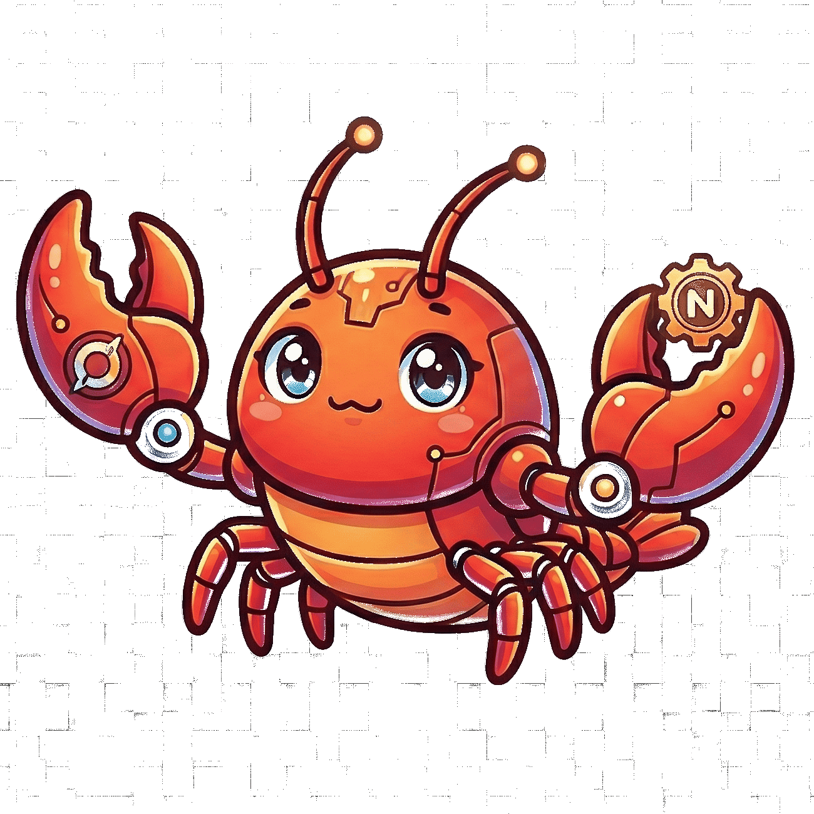

<h1 align="center">
  
  <br>
  WarsClaw
  <br>
  <br>
</h1>

<p align="center">
  世界でもっとも小さい自律オペレーターエージェント — コードベース上で永続稼働する自己改善型AI
</p>

<p align="center">
  
  
  
  
  
</p>

<p align="center">
  <a href="README.md">English</a> •
  <a href="README-ja.md">日本語</a>
</p>

## WarsClawとは？

WarsClaw は**永続稼働する自律オペレーター**です。Slackチャンネルを常時監視し、マウントしたリポジトリを作業スペースとして、自己改善ループを回し続けます。

```
    ┌─── ルール策定 ───→ 実行 ───→ 振り返り ───→ 提案・理解深化 ───┐
    └─────────────────────────────────────────────────────────────┘
```

チャットボットではありません。**自らルールを作り、作業を実行し、結果を振り返り、理解を深め続ける** — すべてを自律的に行うオペレーターです。

[OpenClaw](https://github.com/pjasicek/OpenClaw)（23以上のチャネル、92以上のプラグイン、60k行以上）と [NanoClaw](https://github.com/nicabar/NanoClaw)（~3k行）の両プロジェクトのベストパターンを **~1250行** に凝縮しています。

## 特徴

### 自律ループ
- **Playbook駆動** — 経験から進化する自己管理型ルール集 `playbook.md`
- **行動ログ** — すべての行動をトリガー・行動・結果・学びとともに `action-log.md` に記録
- **振り返り** — Keep / Problem / Try の自動分析を `retrospective.md` に記録
- **知識蓄積** — ドメイン知識を `knowledge.md` に蓄積

### 定期タスク（初回起動時に自動登録）

| スケジュール | タスク |
|------------|--------|
| 平日 9:00 | 朝のオペレーション開始 — playbook確認、中断作業の継続 |
| 平日 18:00 | 日次振り返り — Keep/Problem/Try 分析 |
| 金曜 17:00 | 週次まとめ — パターン特定、改善提案 |
| 月曜 10:00 | playbook棚卸し — 形骸化ルールの削除、不足ルールの追加 |

### インフラストラクチャ
- **Slack常時監視** — 人間の指示をリアルタイムで受信
- **リポジトリワークスペース** — Dockerマウント経由で実際のコードベース上で作業
- **Docker隔離** — 各エージェントはClaude Code CLI入りの一時コンテナで実行
- **グループ単位隔離** — Slackチャンネルごとに独立したコンテキスト・メモリ・ファイル
- **SQLite** 状態管理（自動保持ポリシー: メッセージ30日、タスクログ10k件）

## クイックスタート

### 前提条件

- Node.js 22+
- Docker
- [Slack Botトークン](https://api.slack.com/apps)
- [Anthropic APIキー](https://console.anthropic.com/)

### セットアップ

```bash
# 1. クローンと設定
git clone https://github.com/yoshidashingo/warsclaw.git && cd warsclaw
cp .env.example .env
```

`.env` を編集:

```bash
ANTHROPIC_API_KEY=sk-ant-...
SLACK_BOT_TOKEN=xoxb-...
SLACK_APP_TOKEN=xapp-...
WARSCLAW_WORKSPACE_DIR=/path/to/your/repo   # WarsClawが作業するリポジトリ
WARSCLAW_TIMEZONE=Asia/Tokyo                 # タイムゾーン
```

```bash
# 2. インストールとビルド
npm install
npm run build

# 3. エージェントコンテナイメージのビルド
docker build -t warsclaw-agent -f container/Dockerfile container/

# 4. 起動
npm start
```

### Docker Compose

```bash
docker compose up -d --build
```

## 環境変数

| 変数 | 必須 | デフォルト | 説明 |
|------|------|-----------|------|
| `ANTHROPIC_API_KEY` | Yes | — | Anthropic APIキー |
| `SLACK_BOT_TOKEN` | Yes | — | Slack Botトークン |
| `SLACK_APP_TOKEN` | Yes | — | Slackアプリレベルトークン (Socket Mode) |
| `WARSCLAW_WORKSPACE_DIR` | Yes | — | 作業対象リポジトリのパス |
| `DISCORD_BOT_TOKEN` | No | — | Discord Botトークン |
| `WARSCLAW_POLLING_INTERVAL` | No | `2000` | メッセージポーリング間隔 (ms) |
| `WARSCLAW_MAX_CONTAINERS` | No | `5` | 最大同時実行コンテナ数 |
| `WARSCLAW_TIMEZONE` | No | `UTC` | IANAタイムゾーン |
| `WARSCLAW_ASSISTANT_NAME` | No | `WarsClaw` | Bot表示名 |
| `WARSCLAW_LOG_LEVEL` | No | `info` | ログレベル (debug/info/warn/error) |

## アーキテクチャ

### コンポーネント構成 (~1250行)

| コンポーネント | ファイル | 役割 |
|-------------|---------|------|
| Orchestrator | `src/index.ts` | メインループ、初期化、グレースフルシャットダウン |
| Config | `src/config.ts` | 環境設定 |
| Logger | `src/logger.ts` | JSON構造化ログ、シークレットマスキング |
| Database | `src/db.ts` | SQLite WAL — メッセージ、タスク、セッション、グループ |
| Router | `src/router.ts` | メッセージフォーマットとチャネルルーティング |
| ContainerRunner | `src/container-runner.ts` | Dockerコンテナライフサイクル、マーカーベース出力パース |
| GroupQueue | `src/group-queue.ts` | グループ単位FIFOキュー、グローバル並行制限 |
| IpcWatcher | `src/ipc.ts` | ファイルシステムIPC監視 |
| TaskScheduler | `src/task-scheduler.ts` | cron/interval/once スケジュール管理 |
| ChannelRegistry | `src/channels/registry.ts` | チャネルファクトリパターン |
| DiscordChannel | `src/channels/discord.ts` | Discord統合 |
| SlackChannel | `src/channels/slack.ts` | Slack統合 |
| SkillLoader | `src/skills/loader.ts` | ファイルベースのスキルシステム |

### データフロー

```
Slackメッセージ → ポーリング → グループマッチ → FIFOキュー → Dockerコンテナ (Claude Code CLI)
                                                                    ↓
                                                             /workspace/repo
                                                                    ↓
                                                      action-log.md, IPC出力
                                                                    ↓
                                                      マーカーベースパース → Slackレスポンス
```

### グループごとのファイル管理

```
groups/{グループ名}/
├── playbook.md        # 自己管理型の作業ルール集
├── action-log.md      # 時系列の行動記録
├── retrospective.md   # Keep/Problem/Try 分析
└── knowledge.md       # 蓄積されたドメイン知識
```

### セキュリティ

- コンテナは `--rm`, `--memory=512m`, `--cpus=1` で実行
- プロジェクトルートは読み取り専用、グループフォルダのみ書き込み可能
- `.env` はコンテナ内で `/dev/null` にシャドウイング
- Zodスキーマで全IPC入力をバリデーション
- SQLフィールドホワイトリストでインジェクション防止
- メッセージ30日保持、タスクログ10k件保持

## 開発

```bash
npm run dev          # ウォッチモード (tsx)
npm run test         # Vitest + fast-check PBT (35テスト)
npm run typecheck    # TypeScript strict mode
npm run lint         # ESLint
npm run format       # Prettier
```

## ライセンス

TBD
