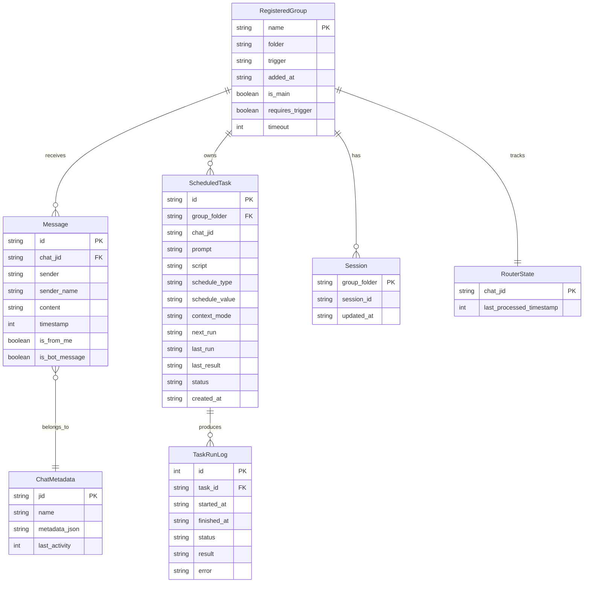

# Domain Entities

## Entity Relationship Diagram

## Entity Definitions

### Message
受信・送信されたメッセージの記録。

| Field | Type | Constraints | Description |
|-------|------|-------------|-------------|
| id | string | PK, NOT NULL | メッセージ固有ID |
| chat_jid | string | NOT NULL, INDEX | チャットグループ識別子 |
| sender | string | NOT NULL | 送信者ID |
| sender_name | string | NOT NULL | 送信者表示名 |
| content | string | NOT NULL | メッセージ本文 |
| timestamp | integer | NOT NULL, INDEX | Unix timestamp (ms) |
| is_from_me | boolean | NOT NULL | ボット自身のメッセージか |
| is_bot_message | boolean | NOT NULL | ボットメッセージか |

### ChatMetadata
チャットグループのメタ情報。

| Field | Type | Constraints | Description |
|-------|------|-------------|-------------|
| jid | string | PK | グループ識別子 |
| name | string | NOT NULL | グループ表示名 |
| metadata_json | string | | チャネル固有メタデータ (JSON) |
| last_activity | integer | INDEX | 最終アクティビティ timestamp |

### RegisteredGroup
エージェント対応として登録されたグループ。

| Field | Type | Constraints | Description |
|-------|------|-------------|-------------|
| name | string | PK | グループ名 |
| folder | string | UNIQUE, NOT NULL | グループフォルダパス |
| trigger | string | NOT NULL | メッセージトリガーワード |
| added_at | string | NOT NULL | 登録日時 (ISO 8601) |
| is_main | boolean | NOT NULL, DEFAULT false | メイン（管理者）グループ |
| requires_trigger | boolean | NOT NULL, DEFAULT true | トリガー必須か |
| timeout | integer | DEFAULT 300 | コンテナタイムアウト (秒) |

### ScheduledTask
自律実行タスク。

| Field | Type | Constraints | Description |
|-------|------|-------------|-------------|
| id | string | PK | UUID |
| group_folder | string | FK → RegisteredGroup, NOT NULL | 所属グループ |
| chat_jid | string | NOT NULL | 結果送信先JID |
| prompt | string | NOT NULL | エージェントへのプロンプト |
| script | string | NULL | 実行スクリプト (optional) |
| schedule_type | string | NOT NULL, CHECK(cron/interval/once) | スケジュール種別 |
| schedule_value | string | NOT NULL | cron式 / interval(ms) / ISO日時 |
| context_mode | string | NOT NULL, DEFAULT 'group' | group / isolated |
| next_run | string | NULL | 次回実行日時 (ISO 8601) |
| last_run | string | NULL | 前回実行日時 |
| last_result | string | NULL | 前回実行結果 (truncated) |
| status | string | NOT NULL, DEFAULT 'active' | active / paused / completed |
| created_at | string | NOT NULL | 作成日時 |

### TaskRunLog
タスク実行の履歴ログ。

| Field | Type | Constraints | Description |
|-------|------|-------------|-------------|
| id | integer | PK, AUTOINCREMENT | ログID |
| task_id | string | FK → ScheduledTask, NOT NULL | タスクID |
| started_at | string | NOT NULL | 開始日時 |
| finished_at | string | NULL | 完了日時 |
| status | string | NOT NULL | success / error / timeout |
| result | string | NULL | 実行結果 (truncated) |
| error | string | NULL | エラー詳細 |

### Session
グループごとのエージェントセッション状態。

| Field | Type | Constraints | Description |
|-------|------|-------------|-------------|
| group_folder | string | PK | グループフォルダ |
| session_id | string | NOT NULL | セッションID |
| updated_at | string | NOT NULL | 最終更新日時 |

### RouterState
チャネルごとのメッセージ処理カーソル。

| Field | Type | Constraints | Description |
|-------|------|-------------|-------------|
| chat_jid | string | PK | チャットJID |
| last_processed_timestamp | integer | NOT NULL | 最終処理済みtimestamp |
