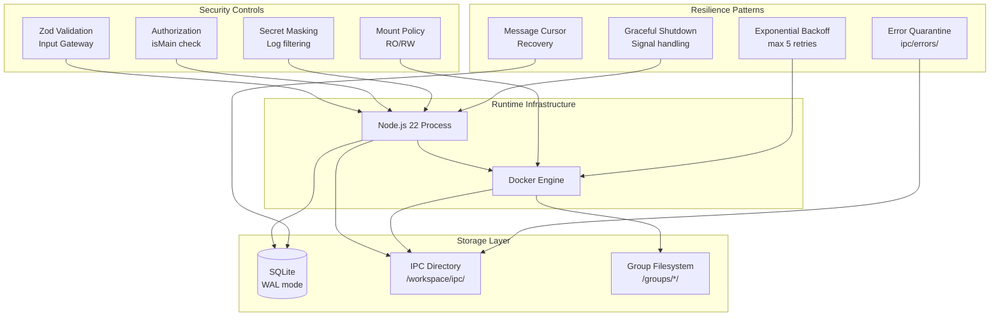

# Logical Components - MyClaw

## Infrastructure Components

### 1. Docker Engine
- **Role**: エージェントコンテナの実行環境
- **Configuration**:
  - Memory limit: 512MB per container
  - CPU limit: 1 core per container
  - Auto-remove: `--rm`
  - Network: host default (Web検索/ブラウザ用)
- **Health Check**: `docker info` でDocker daemon の可用性確認

### 2. SQLite Database
- **Role**: 永続状態ストア
- **Configuration**:
  - Path: `data/myclaw.db`
  - Journal mode: WAL (並行読み取り)
  - Synchronous: NORMAL
  - Foreign keys: ENABLED
- **Indexes**:
  - `messages(chat_jid, timestamp)`
  - `scheduled_tasks(next_run, status)`
  - `chat_metadata(last_activity)`

### 3. Filesystem IPC Directory
- **Role**: コンテナ ↔ メインプロセス間通信
- **Structure**:
  ```
  /workspace/ipc/
  ├── messages/    # エージェント→チャネル フォローアップ
  ├── tasks/       # エージェント→スケジューラ タスク操作
  └── errors/      # 処理失敗ファイルの隔離
  ```
- **Polling**: 1秒間隔
- **File Format**: JSON (.json extension)
- **Lifecycle**: 処理済みファイルは削除、失敗ファイルは errors/ に移動

### 4. Group Filesystem
- **Role**: グループごとのデータ隔離
- **Structure**:
  ```
  groups/
  ├── main/
  │   └── CLAUDE.md       # 管理者指示
  ├── global/
  │   └── CLAUDE.md       # 全グループ共通指示
  └── {group-name}/
      ├── CLAUDE.md       # グループ固有指示
      └── .claude/
          └── sessions/   # セッション履歴
  ```
- **Mount Policy**:
  - Project root → container `/workspace` (RO)
  - Group folder → container `/workspace/groups/{name}` (RW)
  - Global CLAUDE.md → container `/workspace/groups/global/CLAUDE.md` (RO)

## Component Interaction Map



## Docker Image Specification

### Agent Container Image (myclaw-agent)

```dockerfile
FROM node:22-slim

# Chromium for browser automation
RUN apt-get update && apt-get install -y \
    chromium \
    && rm -rf /var/lib/apt/lists/*

# Claude Code CLI
RUN npm install -g @anthropic-ai/claude-code

# Agent runner
WORKDIR /workspace
COPY container/agent-runner /agent-runner
RUN cd /agent-runner && npm install && npm run build

ENTRYPOINT ["node", "/agent-runner/dist/index.js"]
```

### MyClaw Main Image (myclaw)

```dockerfile
FROM node:22-slim

WORKDIR /app
COPY package*.json ./
RUN npm ci --production
COPY dist/ ./dist/
COPY container/ ./container/

# Data directories
RUN mkdir -p /app/data /app/groups/main /app/groups/global

ENTRYPOINT ["node", "dist/index.js"]
```

### Docker Compose

```yaml
version: '3.8'
services:
  myclaw:
    build: .
    volumes:
      - ./data:/app/data
      - ./groups:/app/groups
      - /var/run/docker.sock:/var/run/docker.sock  # Docker-in-Docker
    env_file: .env
    restart: unless-stopped
```

## Monitoring & Observability

### Log Output
- **Format**: JSON structured logs to stdout
- **Fields**: timestamp, level, component, context, message
- **Sensitive data**: Masked (tokens, API keys)
- **Collection**: Docker logging driver → stdout → host log aggregation

### Health Indicators
- Channel connection status (per channel)
- Active container count vs max
- Queue depth per group
- Last successful poll timestamp
- Database file size and WAL size

### Error Tracking
- IPC error quarantine directory size
- Task failure rate (TaskRunLog)
- Container timeout rate
- Channel disconnection events
