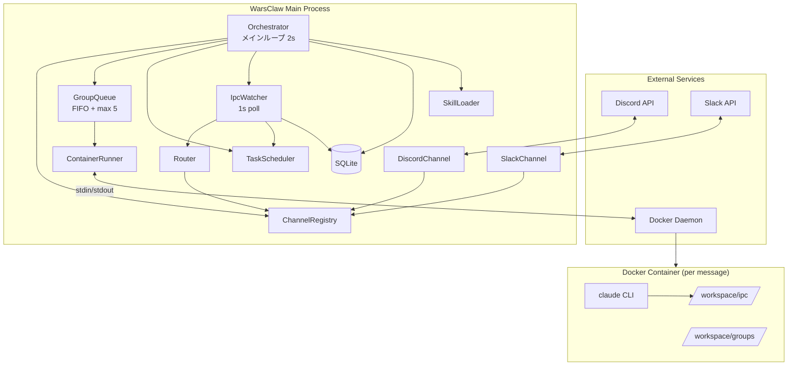

# WarsClaw Application Design

## Design Summary

WarsClaw は NanoClaw のアーキテクチャをベースに ~2000行以下で構築するパーソナルAIエージェント。

**Key Design Decisions:**
- **Agent Runtime**: Claude Code CLI をDockerコンテナ内でstdin/stdout経由実行
- **Container Lifecycle**: メッセージごとにコンテナを起動・終了（完全隔離）
- **IPC**: ファイルシステムベースのJSON（シンプル、デバッグ容易）
- **Architecture**: 単一プロセス、ポーリングベース、グループ単位キュー

---

## Architecture Overview



## Components (13)

| # | Component | File | LOC目安 | Purpose |
|---|-----------|------|---------|---------|
| 1 | Orchestrator | src/index.ts | ~150 | エントリポイント、メインループ |
| 2 | ChannelRegistry | src/channels/registry.ts | ~50 | チャネルファクトリ管理 |
| 3 | DiscordChannel | src/channels/discord.ts | ~150 | Discord統合 |
| 4 | SlackChannel | src/channels/slack.ts | ~150 | Slack統合 |
| 5 | Router | src/router.ts | ~100 | メッセージフォーマット・ルーティング |
| 6 | GroupQueue | src/group-queue.ts | ~150 | FIFO + 並行制御 |
| 7 | ContainerRunner | src/container-runner.ts | ~200 | Docker実行・出力パース |
| 8 | IpcWatcher | src/ipc.ts | ~150 | ファイルIPC監視 |
| 9 | TaskScheduler | src/task-scheduler.ts | ~150 | スケジュール管理 |
| 10 | Database | src/db.ts | ~200 | SQLite CRUD |
| 11 | Config | src/config.ts | ~80 | 環境設定 |
| 12 | Logger | src/logger.ts | ~40 | 構造化ログ |
| 13 | SkillLoader | src/skills/loader.ts | ~50 | スキル読み込み |
| | Types | src/types.ts | ~100 | 型定義 |
| | **合計** | | **~1720** | |

## Key Interfaces

```typescript
// Channel contract
interface Channel {
  name: string;
  connect(): Promise<void>;
  disconnect(): Promise<void>;
  isConnected(): boolean;
  ownsJid(jid: string): boolean;
  sendMessage(jid: string, text: string): Promise<void>;
  onInboundMessage(callback: (msg: NewMessage) => void): void;
}

// Container I/O
interface ContainerInput {
  prompt: string;
  sessionId: string;
  groupFolder: string;
  chatJid: string;
  isMain: boolean;
  isScheduledTask: boolean;
}

interface ContainerOutput {
  status: 'success' | 'error';
  result: string;
  newSessionId?: string;
  error?: string;
}

// Message model
interface NewMessage {
  id: string;
  chat_jid: string;
  sender: string;
  sender_name: string;
  content: string;
  timestamp: number;
  is_from_me: boolean;
  is_bot_message: boolean;
}
```

## Communication Patterns

1. **同期呼び出し**: コンポーネント間はasync/await
2. **コールバック**: チャネルからのインバウンドメッセージ
3. **ファイルIPC**: コンテナ → メインプロセス (JSON)
4. **stdin/stdout**: メインプロセス → コンテナ (マーカーベース)

## Initialization Order

```
Config → Logger → Database → ChannelRegistry → Router →
ContainerRunner → GroupQueue → TaskScheduler → IpcWatcher →
SkillLoader → Channel Registration → Orchestrator.start()
```

## File Structure

```
warsclaw/
├── src/
│   ├── index.ts              # Orchestrator
│   ├── types.ts              # 全型定義
│   ├── config.ts             # 環境設定
│   ├── db.ts                 # SQLite
│   ├── router.ts             # メッセージルーティング
│   ├── group-queue.ts        # グループキュー
│   ├── container-runner.ts   # Docker実行
│   ├── ipc.ts                # IPC監視
│   ├── task-scheduler.ts     # タスクスケジューラ
│   ├── logger.ts             # ログ
│   ├── channels/
│   │   ├── registry.ts       # ファクトリ
│   │   ├── discord.ts        # Discord
│   │   └── slack.ts          # Slack
│   └── skills/
│       └── loader.ts         # スキル読み込み
├── container/
│   ├── Dockerfile            # エージェントコンテナ
│   └── agent-runner/
│       └── index.ts          # コンテナエントリポイント
├── groups/
│   ├── main/CLAUDE.md        # メイングループ指示
│   └── global/CLAUDE.md      # 全グループ共通指示
├── data/                     # SQLite DB
├── skills/                   # ファイルベーススキル
├── package.json
├── tsconfig.json
├── Dockerfile                # WarsClaw本体コンテナ
└── docker-compose.yml
```

## Cross-References
- **Detailed component definitions**: [components.md](components.md)
- **Method signatures**: [component-methods.md](component-methods.md)
- **Service orchestration**: [services.md](services.md)
- **Dependency relationships**: [component-dependency.md](component-dependency.md)
