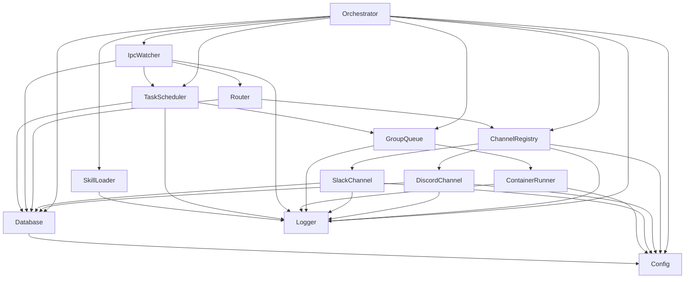
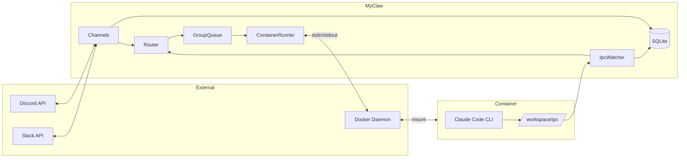

# Component Dependencies

## Dependency Matrix

| Component | Depends On | Depended By |
|-----------|-----------|-------------|
| Orchestrator | ChannelRegistry, GroupQueue, TaskScheduler, IpcWatcher, Database, Config, Logger | — (top-level) |
| ChannelRegistry | Config, Logger | Orchestrator, Router |
| DiscordChannel | Config, Database, Logger | ChannelRegistry |
| SlackChannel | Config, Database, Logger | ChannelRegistry |
| Router | ChannelRegistry, Database | Orchestrator, IpcWatcher |
| GroupQueue | ContainerRunner, Logger | Orchestrator, TaskScheduler |
| ContainerRunner | Config, Logger | GroupQueue |
| IpcWatcher | Database, Router, TaskScheduler, Logger | Orchestrator |
| TaskScheduler | Database, GroupQueue, Logger | Orchestrator, IpcWatcher |
| Database | Config | 全コンポーネント |
| Config | — | 全コンポーネント |
| Logger | — | 全コンポーネント |
| SkillLoader | Logger | Orchestrator |

## Dependency Graph



## Communication Patterns

### 1. 同期呼び出し (Direct Call)
すべてのコンポーネント間通信は同期的なメソッド呼び出し（または async/await）。

```
Orchestrator → ChannelRegistry.connectAll()
Router → ChannelRegistry.findByJid(jid)
GroupQueue → ContainerRunner.run(input)
TaskScheduler → Database.getDueTasks()
```

### 2. コールバック (Event Callback)
チャネルからのインバウンドメッセージはコールバックパターン。

```
channel.onInboundMessage((msg) => {
  db.storeMessage(msg)
  queue.enqueue(msg.chat_jid, task)
})
```

### 3. ファイルシステムIPC (Async File Polling)
コンテナ ↔ メインプロセス間はJSONファイルで非同期通信。

```
Container writes → /workspace/ipc/messages/msg_001.json
IpcWatcher reads → processes → deletes file
```

### 4. stdin/stdout (Container I/O)
メインプロセス → Docker コンテナは stdin/stdout で通信。

```
Main Process → stdin: JSON(ContainerInput)
Container → stdout: <<<OUTPUT_START>>>JSON(ContainerOutput)<<<OUTPUT_END>>>
```

## Data Flow Diagram



## Initialization Order

```
1. Config.fromEnv()
2. Logger (依存なし)
3. Database.init() (Config)
4. ChannelRegistry (Config, Logger)
5. Router (ChannelRegistry, Database)
6. ContainerRunner (Config, Logger)
7. GroupQueue (ContainerRunner, Logger)
8. TaskScheduler (Database, GroupQueue, Logger)
9. IpcWatcher (Database, Router, TaskScheduler, Logger)
10. SkillLoader (Logger)
11. Channel Registration (DiscordChannel, SlackChannel)
12. Orchestrator.start() — connects channels, starts polling
```
