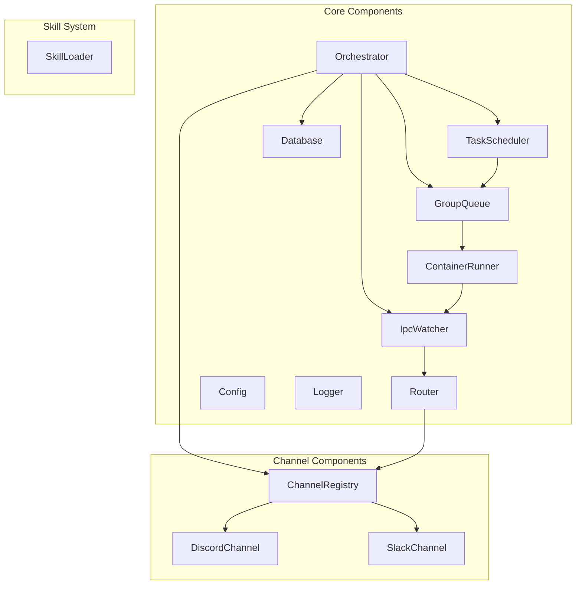

# Components

## Component Overview

## Component Definitions

### 1. Orchestrator
- **ファイル**: `src/index.ts`
- **Purpose**: アプリケーションのエントリポイント。全コンポーネントの初期化とメインポーリングループの実行
- **Responsibilities**:
  - チャネルの初期化と接続管理
  - グループ登録とメタデータ同期
  - メッセージポーリングループ (設定可能な間隔、デフォルト2秒)
  - スケジュールタスクのトリガー
  - Graceful shutdown

### 2. ChannelRegistry
- **ファイル**: `src/channels/registry.ts`
- **Purpose**: チャネル実装のファクトリ登録と管理
- **Responsibilities**:
  - チャネルファクトリの登録
  - JIDに基づくチャネルの検索
  - チャネルの接続/切断ライフサイクル管理

### 3. DiscordChannel
- **ファイル**: `src/channels/discord.ts`
- **Purpose**: Discord メッセージングプラットフォームとの統合
- **Responsibilities**:
  - Discord Bot APIを通じたメッセージのポーリング
  - グループ（ギルド/チャンネル）の同期
  - メッセージの送受信
  - JID所有権の判定

### 4. SlackChannel
- **ファイル**: `src/channels/slack.ts`
- **Purpose**: Slack メッセージングプラットフォームとの統合
- **Responsibilities**:
  - Slack Events APIを通じたメッセージ取得
  - ワークスペース/チャンネルの同期
  - メッセージの送受信
  - スレッド追跡

### 5. Router
- **ファイル**: `src/router.ts`
- **Purpose**: メッセージのフォーマットとチャネルルーティング
- **Responsibilities**:
  - 受信メッセージのXMLフォーマット化（エージェントコンテキスト用）
  - JIDに基づく適切なチャネルへのアウトバウンドルーティング
  - メッセージカーソル管理（重複処理防止）

### 6. GroupQueue
- **ファイル**: `src/group-queue.ts`
- **Purpose**: グループ単位のFIFOキューとグローバル並行制御
- **Responsibilities**:
  - グループごとのメッセージキューイング (FIFO)
  - グローバルコンテナ並行制限 (デフォルト5)
  - 指数バックオフリトライ (最大5回)
  - IPC待機状態の管理

### 7. ContainerRunner
- **ファイル**: `src/container-runner.ts`
- **Purpose**: Docker コンテナ内で Claude Code CLI を実行
- **Responsibilities**:
  - Docker コンテナの起動（メッセージごと）
  - グループフォルダのボリュームマウント（プロジェクトルート: 読み取り専用、グループ: 読み書き）
  - 環境変数のシャドウイング
  - stdin で ContainerInput を送信、stdout から ContainerOutput をパース
  - マーカーベースの出力抽出 (START/END delimiters)
  - アクティブプロセスの追跡

### 8. IpcWatcher
- **ファイル**: `src/ipc.ts`
- **Purpose**: ファイルシステムベースのプロセス間通信監視
- **Responsibilities**:
  - /workspace/ipc/ ディレクトリのJSONファイル監視 (1秒ポーリング)
  - タスク作成/変更リクエストの処理
  - エージェントからのフォローアップメッセージのルーティング
  - メイングループ特権の認可チェック
  - 処理失敗時のエラーファイル隔離 (errors/)

### 9. TaskScheduler
- **ファイル**: `src/task-scheduler.ts`
- **Purpose**: 自律タスクのスケジュール管理と実行
- **Responsibilities**:
  - cron式の解析 (IANAタイムゾーン対応)
  - interval/once スケジュールの管理
  - next_run の計算とドリフト防止
  - 期限到来タスクのグループキューへのエンキュー
  - 実行ログの記録

### 10. Database
- **ファイル**: `src/db.ts`
- **Purpose**: SQLite による永続状態管理
- **Responsibilities**:
  - スキーマ初期化とマイグレーション
  - メッセージ履歴 CRUD
  - チャットメタデータ管理
  - スケジュールタスク CRUD
  - タスク実行ログ
  - セッション状態管理
  - グループ登録管理
  - ルーター状態（メッセージカーソル）

### 11. Config
- **ファイル**: `src/config.ts`
- **Purpose**: 環境設定の一元管理
- **Responsibilities**:
  - 環境変数の読み込みとバリデーション
  - パス解決 (data/, groups/, store/)
  - デフォルト値の提供
  - タイムゾーンバリデーション

### 12. Logger
- **ファイル**: `src/logger.ts`
- **Purpose**: 構造化ログ
- **Responsibilities**:
  - コンテキスト付きオブジェクトログ
  - ログレベル管理
  - タイムスタンプ付与

### 13. SkillLoader
- **ファイル**: `src/skills/loader.ts`
- **Purpose**: ファイルベースのスキルシステム
- **Responsibilities**:
  - skills/ ディレクトリからのスキル検出と読み込み
  - チャネルスキル、ユーティリティスキル、コンテナスキルの分類
  - スキルのライフサイクル管理
