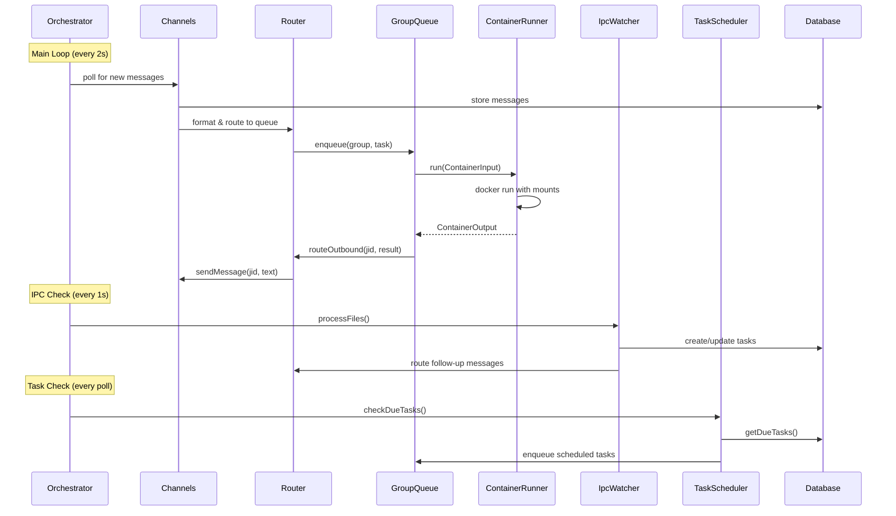

# Services

## Service Architecture

WarsClaw は単一プロセスのサービスアーキテクチャを採用。Orchestrator がすべてのコンポーネントを統合し、ポーリングベースのイベントループで駆動する。



## Service Definitions

### 1. Message Processing Service
- **担当**: Orchestrator + Channels + Router + GroupQueue + ContainerRunner
- **フロー**:
  1. Orchestrator がチャネルをポーリング
  2. 新着メッセージを Database に保存
  3. Router がメッセージをフォーマットし GroupQueue にエンキュー
  4. GroupQueue が並行制限内で ContainerRunner を起動
  5. ContainerRunner が Docker コンテナ内で Claude Code CLI を実行
  6. レスポンスを Router 経由で元のチャネルに送信

### 2. IPC Processing Service
- **担当**: IpcWatcher + Router + TaskScheduler + Database
- **フロー**:
  1. IpcWatcher が /workspace/ipc/ をポーリング (1秒間隔)
  2. タスク関連 JSON → TaskScheduler で処理
  3. メッセージ関連 JSON → Router で配信
  4. 処理済みファイルを削除、失敗ファイルを errors/ に移動

### 3. Task Scheduling Service
- **担当**: TaskScheduler + GroupQueue + Database
- **フロー**:
  1. Orchestrator のメインループで TaskScheduler.checkDueTasks() を呼び出し
  2. 期限到来タスクを Database から取得
  3. タスクを GroupQueue にエンキュー（グループコンテキストで実行）
  4. 実行結果を Database に記録
  5. next_run を再計算して更新

### 4. Group Management Service
- **担当**: Orchestrator + Database + Channels
- **フロー**:
  1. メイングループからの register_group IPC で新グループ登録
  2. チャネルの syncGroups でメタデータ更新
  3. グループフォルダの作成と CLAUDE.md の初期化

### 5. Lifecycle Service
- **担当**: Orchestrator
- **フロー**:
  1. 起動: Config読み込み → DB初期化 → チャネル接続 → ポーリング開始
  2. 実行: メインループ (message poll + task check + IPC watch)
  3. 停止: SIGTERM/SIGINT → 新規キュー停止 → 実行中コンテナ完了待機 → チャネル切断 → DB クローズ

## Orchestration Patterns

### Polling Loop (メインループ)
```
while (running) {
  // 1. Check channels for new messages
  for (channel of channels) poll(channel)

  // 2. Check scheduled tasks
  scheduler.checkDueTasks()

  // 3. Process IPC files
  ipcWatcher.processFiles()

  // 4. Wait for next interval
  await sleep(config.pollingInterval)
}
```

### Error Handling Strategy
- **チャネルエラー**: ログ記録、次のポーリングで再試行
- **コンテナエラー**: 指数バックオフリトライ (5s base, max 5回)
- **IPCエラー**: ファイルを errors/ に移動、ログ記録
- **DBエラー**: クリティカルログ、プロセス終了
