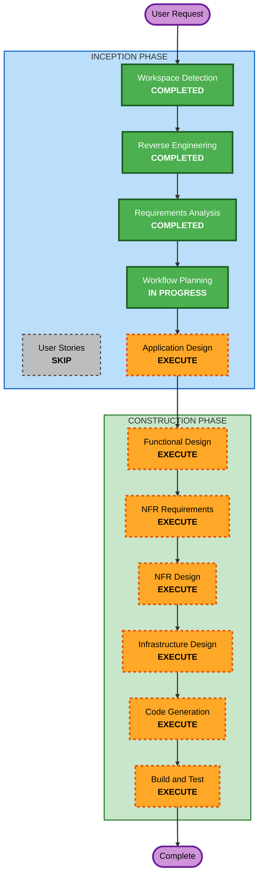

# Execution Plan

## Detailed Analysis Summary

### Change Impact Assessment
- **User-facing changes**: Yes — 新規マルチチャネルAIエージェントシステムの構築
- **Structural changes**: Yes — ゼロからのアーキテクチャ構築
- **Data model changes**: Yes — SQLiteスキーマ設計が必要
- **API changes**: Yes — Channel interface、Container I/O、IPC protocol の設計
- **NFR impact**: Yes — Docker隔離、セキュリティ、並行制御、PBT

### Risk Assessment
- **Risk Level**: Medium — 新規プロジェクトだが既存プロジェクトを参考にしており不確実性は低い
- **Rollback Complexity**: Easy — 新規プロジェクトのため任意の時点に戻れる
- **Testing Complexity**: Moderate — Docker統合テスト、PBT、チャネルモックが必要

## Workflow Visualization

## Phases to Execute

### INCEPTION PHASE
- [x] Workspace Detection (COMPLETED)
- [x] Reverse Engineering (COMPLETED) — OpenClaw + NanoClaw 分析完了
- [x] Requirements Analysis (COMPLETED) — 12問の要件確認完了
- [x] User Stories — SKIP
  - **Rationale**: 単一ユーザー向けパーソナルエージェント。ペルソナは1つ（本人）。User Storiesの付加価値が低い
- [x] Workflow Planning (IN PROGRESS)
- [ ] Application Design — EXECUTE
  - **Rationale**: 新規コンポーネント設計が必要（Gateway、Channel、Queue、Container Runner、IPC、Scheduler、DB）。コンポーネント間の依存関係とインターフェースを定義する必要がある
- [ ] Units Generation — SKIP
  - **Rationale**: ~2000行のシングルパッケージプロジェクト。複数ユニットへの分解は不要

### CONSTRUCTION PHASE
- [ ] Functional Design — EXECUTE
  - **Rationale**: SQLiteスキーマ、メッセージルーティングロジック、スケジューリングロジック等のビジネスルールを設計する必要がある
- [ ] NFR Requirements — EXECUTE
  - **Rationale**: Docker隔離セキュリティ、並行制御、PBTの要件を明確にする必要がある
- [ ] NFR Design — EXECUTE
  - **Rationale**: Security Baseline拡張が有効。コンテナ隔離パターン、入力バリデーション、権限管理の設計が必要
- [ ] Infrastructure Design — EXECUTE
  - **Rationale**: Dockerfile、Docker Compose、コンテナボリュームマウント設計が必要
- [ ] Code Generation — EXECUTE (ALWAYS)
  - **Rationale**: 実装コード生成（~2000行以下目標）
- [ ] Build and Test — EXECUTE (ALWAYS)
  - **Rationale**: ビルド手順、テスト戦略（Vitest + PBT）の定義

### OPERATIONS PHASE
- [ ] Operations — PLACEHOLDER

## Success Criteria
- **Primary Goal**: ~2000行以下でDiscord + Slack対応のパーソナルAIエージェントを構築
- **Key Deliverables**:
  - Docker コンテナで動作するClaude Codeベースのエージェント
  - Discord + Slack チャネル統合
  - SQLiteベースの状態管理
  - グループ単位の隔離
  - スケジュールタスク
  - Web検索 + ブラウザ自動化
  - ファイルベースのスキルシステム
- **Quality Gates**:
  - コードサイズ ~2000行以下
  - Security Baseline ルール準拠
  - PBT テスト実装
  - TypeScript strict mode
  - Docker でのデプロイ可能
