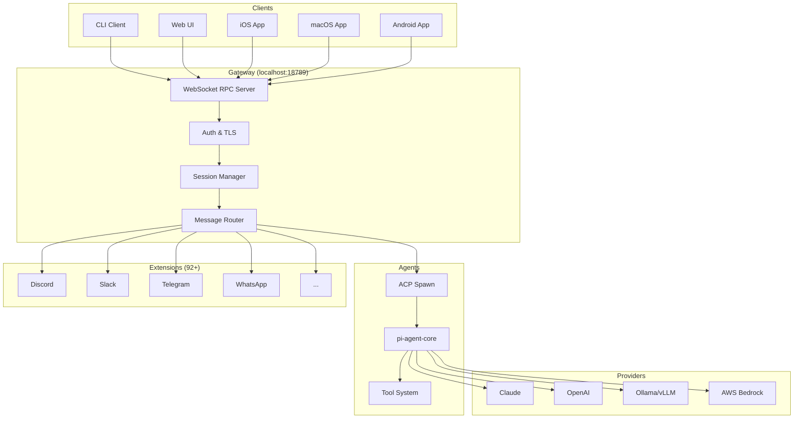
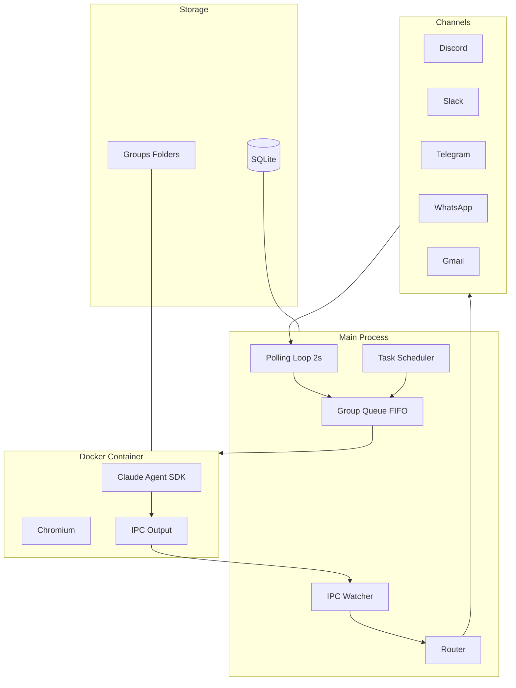
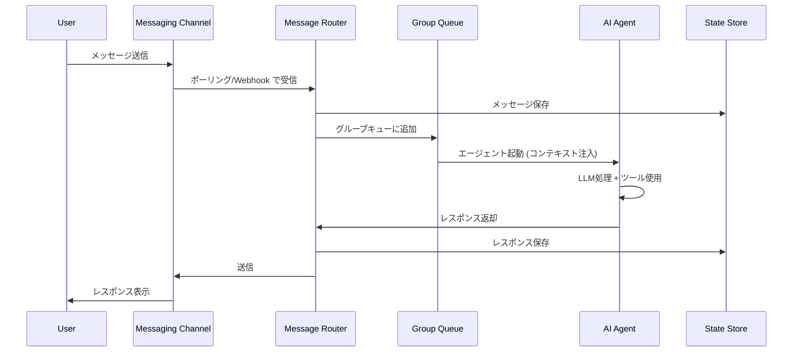

# System Architecture

## System Overview

OpenClawとNanoClawは同じドメイン（パーソナルAIエージェント）の異なるアプローチ：

| 特性 | OpenClaw | NanoClaw |
|------|----------|----------|
| アーキテクチャ | WebSocket RPC Gateway | Polling Loop + Docker |
| 規模 | 60,000+ LOC | ~3,000 LOC |
| チャネル数 | 23+ | 5 (Discord, Slack, Gmail, Telegram, WhatsApp) |
| エージェント実行 | pi-agent-core + ACP spawn | Claude Agent SDK in Docker |
| 状態管理 | YAML config + セッション | SQLite |
| ネイティブアプリ | iOS, macOS, Android | なし |
| プラグインシステム | Plugin SDK (60+ exports) | Skill system |

## Architecture Diagram - OpenClaw

## Architecture Diagram - NanoClaw

## Data Flow

## Integration Points

- **External APIs**: 各メッセージングプラットフォームAPI (Discord.js, Slack Bolt, WhatsApp Business API等)
- **AI Providers**: Anthropic Claude, OpenAI, Google Gemini, AWS Bedrock, Ollama, vLLM等
- **Databases**: SQLite (NanoClaw), YAML + ファイルシステム (OpenClaw)
- **Third-party Services**: Edge TTS, Web検索, ブラウザ自動化 (Playwright/Chromium)

## Infrastructure Components

- **OpenClaw**: ローカルデバイス上のNode.jsプロセス、TLS対応WebSocket Gateway
- **NanoClaw**: Node.jsメインプロセス + Docker コンテナ (エージェント隔離)
- **Deployment**: launchd (macOS), systemd (Linux)
