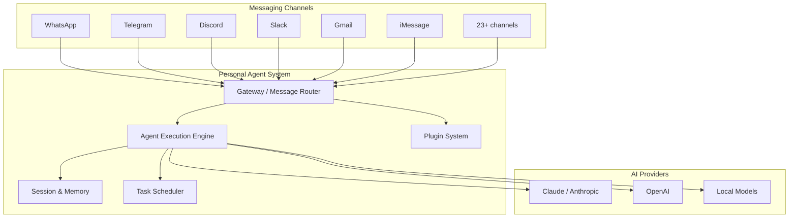

# Business Overview

## Business Context Diagram

## Business Description

- **Business Description**: OpenClaw と NanoClaw は、ユーザーが既存のメッセージングプラットフォーム（WhatsApp, Slack, Discord, Telegram 等）を通じてAIエージェントと対話できるパーソナルエージェントシステム。単一のAIアシスタントが複数チャネルにまたがって応答し、グループごとに会話コンテキストを隔離して管理する。

- **Business Transactions**:
  1. **マルチチャネルメッセージング** - ユーザーが任意の接続済みプラットフォームからAIアシスタントにメッセージを送信し、同じチャネルを通じてレスポンスを受け取る
  2. **グループベース隔離** - 各メッセージンググループが独自の会話コンテキスト、ファイル、メモリを維持
  3. **スケジュールタスク自動化** - cronスケジュール、インターバル、ワンタイム実行による自律タスク
  4. **Web アクセス & ブラウザ自動化** - Webスクレイピング、フォーム自動化、API操作
  5. **永続メモリ & 状態管理** - セッション横断でコンテキストを維持
  6. **管理者制御** - メインチャネルからの特権操作（グループ登録、メタデータ更新）
  7. **プラグイン/スキル拡張** - コア変更なしに新チャネルや機能を追加

- **Business Dictionary**:
  - **Channel**: メッセージングプラットフォーム（WhatsApp, Discord等）との接続
  - **Gateway**: WebSocket RPCベースの制御プレーン（OpenClaw）
  - **Group / JID**: メッセージングプラットフォーム上のグループ識別子
  - **Session**: ユーザー/グループごとの会話状態
  - **Plugin / Skill**: 拡張機能の単位
  - **Container**: エージェント実行のための隔離環境（NanoClaw）
  - **IPC**: プロセス間通信（ファイルシステムベース、NanoClaw）
  - **MCP**: Model Context Protocol

## Component Level Business Descriptions

### OpenClaw
- **Purpose**: 23以上のメッセージングプラットフォームに対応するフル機能パーソナルエージェント
- **Responsibilities**: Gateway制御プレーン、プラグインSDK、ネイティブアプリ（iOS/macOS/Android）、92以上のバンドルプラグイン

### NanoClaw
- **Purpose**: OpenClawの軽量版クローン。ポーリングベースのシンプルなアーキテクチャ
- **Responsibilities**: Dockerコンテナ隔離でのエージェント実行、SQLiteベースの状態管理、グループごとのキュー管理
