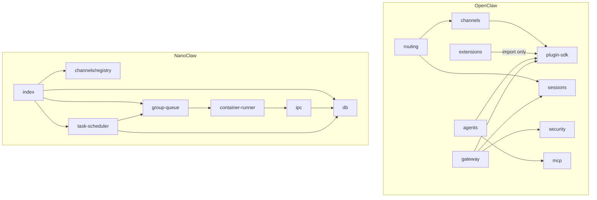

# Dependencies

## Internal Dependencies

### OpenClaw Internal Dependencies

| From | To | Type | Reason |
|------|----|------|--------|
| gateway | plugin-sdk | Compile | RPCメソッドがプラグイン型を使用 |
| gateway | sessions | Compile | セッション管理 |
| gateway | security | Compile | 認証・認可 |
| agents | plugin-sdk | Compile | エージェントツール型 |
| extensions | plugin-sdk | Compile | 唯一許可されたimportパス |
| routing | channels | Compile | メッセージ配送 |

### NanoClaw Internal Dependencies

| From | To | Type | Reason |
|------|----|------|--------|
| index | channels/registry | Compile | チャネル初期化 |
| index | group-queue | Compile | メッセージキューイング |
| index | db | Compile | 状態永続化 |
| group-queue | container-runner | Compile | コンテナ起動 |
| container-runner | ipc | Runtime | プロセス間通信 |
| task-scheduler | db | Compile | タスクCRUD |
| task-scheduler | group-queue | Compile | タスク実行キューイング |

## External Dependencies

### AI Provider SDKs

| Dependency | Version | Purpose | License |
|-----------|---------|---------|---------|
| @mariozechner/pi-agent-core | 0.63.1 | エージェントフレームワーク (OpenClaw) | - |
| @anthropic-ai/claude-code | - | Claude Agent SDK (NanoClaw) | - |
| @modelcontextprotocol/sdk | 1.28.0 | MCP対応 (OpenClaw) | MIT |
| @agentclientprotocol/sdk | 0.17.0 | ACP (OpenClaw) | - |
| @aws-sdk/client-bedrock | 3.1019.0 | AWS Bedrock (OpenClaw) | Apache-2.0 |

### Messaging Platform SDKs

| Dependency | Purpose | License |
|-----------|---------|---------|
| discord.js | Discord統合 | Apache-2.0 |
| @slack/bolt | Slack統合 | MIT |
| matrix-js-sdk | Matrix統合 (OpenClaw) | Apache-2.0 |
| @signalapp/libsignal | Signal統合 (OpenClaw) | AGPL-3.0 |

### Data & Storage

| Dependency | Version | Purpose | License |
|-----------|---------|---------|---------|
| better-sqlite3 | 11.10.0 | SQLite (NanoClaw) | MIT |
| cron-parser | 5.5.0 | cronパース (NanoClaw) | MIT |

### Server & Runtime

| Dependency | Version | Purpose | License |
|-----------|---------|---------|---------|
| ws | 8.20.0 | WebSocket (OpenClaw) | MIT |
| express | 5.2.1 | HTTP (OpenClaw) | MIT |
| hono | 4.12.9 | Edge runtime (OpenClaw) | MIT |
| zod | 4.3.6 | バリデーション (OpenClaw) | MIT |

### Media & Processing

| Dependency | Version | Purpose | License |
|-----------|---------|---------|---------|
| sharp | 0.34.5 | 画像処理 (OpenClaw) | Apache-2.0 |
| playwright-core | 1.58.2 | ブラウザ自動化 (OpenClaw) | Apache-2.0 |
| node-edge-tts | - | TTS (OpenClaw) | MIT |
